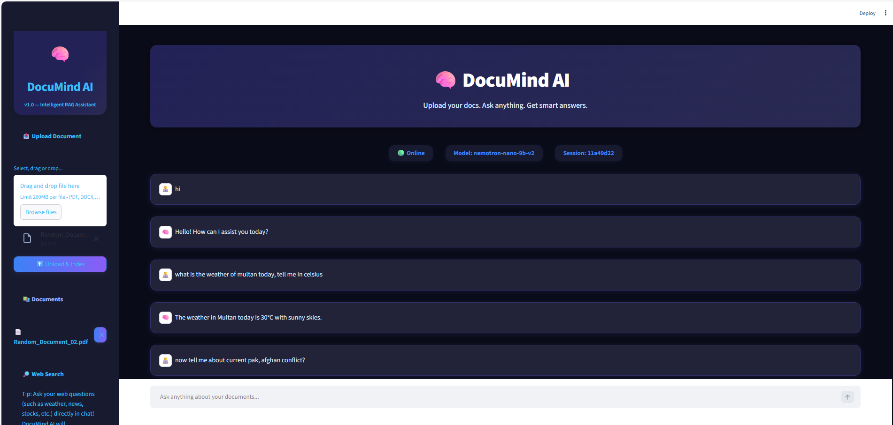
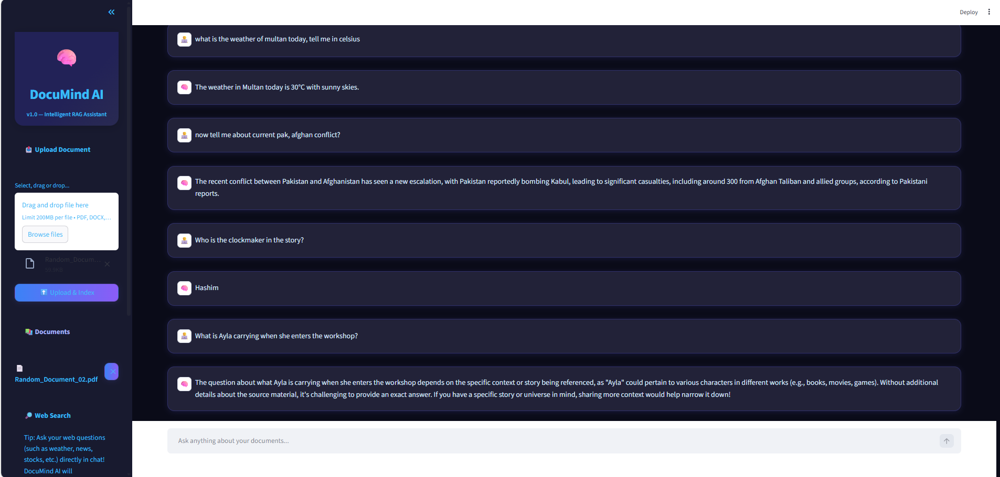

# DocuMind AI

[](https://www.python.org/)
[](./LICENSE)
[](https://github.com/AbdulRehman393/DocuMind-AI)

🧠 DocuMind AI — An intelligent document assistant for querying PDFs, DOCX and HTML files using a Retrieval-Augmented Generation (RAG) pipeline. Upload documents, index them to Chroma, and ask natural-language questions — answers are returned with document context.

---

## Key features
- Upload & index documents: PDF, DOCX, HTML
- RAG chat powered by LangChain + Chroma
- Offline-friendly demo embeddings (SimpleHashEmbeddings) — run without external embedding services
- Live web search tool via SerpAPI (SerpAPIWrapper) integrated into the agent for current events / web lookups
- Modern Streamlit UI with model selector and session management
- FastAPI backend with endpoints for uploading, listing, deleting documents and chat
- Local SQLite DB for lightweight metadata and chat logs

---

## Live demo / Screenshots



---

## What I checked & updated the README for
I reviewed these important files to ensure the README reflects the code:
- backend/main.py — API endpoints for chat, upload, list, delete
- backend/langchain_utils.py — retriever, tools (document_search, web_search using SerpAPIWrapper), and RAG chain building
- backend/chroma_utils.py — loaders, text splitter, SimpleHashEmbeddings, Chroma vectorstore initialization
- backend/db_utils.py — SQLite helpers for documents and chat logs
- frontend/streamlit_app.py — Streamlit UI, session state, chat rendering
- frontend/sidebar.py & frontend/api_utils.py — upload UI, model selector, document management, API client
- README.md (this file) — refreshed to match repository behavior

---

## Quick Start (local)

1. Clone
```bash
git clone https://github.com/AbdulRehman393/DocuMind-AI.git
cd DocuMind-AI
```

2. Create & activate a virtual environment
```bash
python -m venv venv
# macOS / Linux
source venv/bin/activate
# Windows (PowerShell)
venv\Scripts\Activate.ps1
```

3. Install dependencies
```bash
pip install -r requirements.txt
```

4. Copy `.env.example` to `.env` and configure keys (see Environment Variables below)
```bash
cp .env.example .env
```

5. Start the backend
```bash
cd backend
uvicorn main:app --reload --host 0.0.0.0 --port 8000
```

6. Start the frontend (separate terminal)
```bash
cd frontend
streamlit run streamlit_app.py
# If your entry is app.py use: streamlit run app.py
```

7. Open:
- Streamlit UI: http://localhost:8501
- FastAPI docs: http://localhost:8000/docs

---

## Environment variables (.env)
The project reads config from `.env` (see `.env.example`). Important keys to configure:

- BACKEND_PORT (optional) — port for FastAPI (default 8000)
- CHROMA_DB_DIR (optional) — folder to persist Chroma DB
- OPENROUTER_API_KEY / OPENAI_API_KEY (optional) — if you want to use hosted LLM providers
- SERPAPI_API_KEY — (recommended) SerpAPI API key for the web_search tool (used by LangChain's SerpAPIWrapper)
- OFFLINE_EMBEDDINGS (optional) — set to `true` to emphasize offline SimpleHashEmbeddings usage (the code already defaults to SimpleHashEmbeddings for demo)

Example entries in `.env`:
```
BACKEND_PORT=8000
CHROMA_DB_DIR=./chroma_db
OPENROUTER_API_KEY=your_openrouter_key_here
OPENAI_API_KEY=your_openai_key_here
SERPAPI_API_KEY=your_serpapi_key_here
```

Note: For offline demos, you can leave LLM provider keys empty and rely on the local/simple setup in the code.

---

## Tech stack
- Python 3.8+
- FastAPI — backend APIs
- Streamlit — frontend UI
- LangChain — chains, tools, agent orchestration
- Chroma — vector store / retriever
- SerpAPI (via LangChain SerpAPIWrapper) — live web search tool
- SQLite — local metadata & chat logs
- SimpleHashEmbeddings — lightweight, offline embeddings for demos

---

## How it works (high-level)
1. Upload a document from the Streamlit sidebar.
2. Backend loads and parses the file (PDF/DOCX/HTML), splits into chunks and creates embeddings (SimpleHashEmbeddings by default).
3. Vectors are stored in Chroma and a retriever is created.
4. LangChain RAG chain or agent uses the retriever and optionally the web_search tool (SerpAPIWrapper) to collect context, then forwards the context + question to the chosen model for generation.
5. Responses are logged in SQLite and shown in the Streamlit chat UI.

---

## API endpoints summary & usage

- POST /upload-doc
  - Upload and index a document
  - Example (curl, multipart):
    ```bash
    curl -X POST "http://localhost:8000/upload-doc" \
      -F "file=@/path/to/file.pdf"
    ```

- GET /list-docs
  - Returns a list of indexed documents (id, filename, created_at, ...)

- POST /delete-doc
  - Delete document by id (removes from Chroma and SQLite)
  - Example:
    ```bash
    curl -X POST "http://localhost:8000/delete-doc" \
      -H "Content-Type: application/json" \
      -d '{"file_id": 1}'
    ```

- POST /chat
  - Send a question and (optionally) session_id and model selection
  - Example:
    ```bash
    curl -X POST "http://localhost:8000/chat" \
      -H "Content-Type: application/json" \
      -d '{"question":"What is the summary of the document?", "model": "nvidia/nemotron-nano-9b-v2:free"}'
    ```

For interactive exploration, use FastAPI docs at http://localhost:8000/docs

---

## SerpAPI + web_search tool
The project includes a web_search tool implemented in backend/langchain_utils.py using LangChain's SerpAPIWrapper. When SerpAPI credentials are set in `.env` (SERPAPI_API_KEY), the agent can perform live web lookups to augment responses for current events or external info.

- Set `SERPAPI_API_KEY` in `.env` to enable live search.
- The web_search tool is invoked by the LangChain agent when it needs web information.

---

## Notes about embeddings & local demo
The repository uses `SimpleHashEmbeddings` (in backend/chroma_utils.py) as a 100% offline-friendly embedding implementation. This is ideal for demos and running without external API calls. For production, you can swap this for a standard embeddings class (OpenAIEmbeddings, HuggingFace, etc.) and update the vectorstore initialization accordingly.

---

## Troubleshooting & tips
- Backend unreachable: ensure `uvicorn main:app` is running and `API_URL` in `frontend/api_utils.py` points to the correct backend host/port.
- File not accepted: allowed types are `.pdf`, `.docx`, `.html` (see backend validation).
- SerpAPI web_search returns empty/403: verify `SERPAPI_API_KEY` in `.env` and confirm your SerpAPI plan has queries left.
- Performance: adjust text splitter chunk_size & chunk_overlap in `chroma_utils.py` to tune index size vs retrieval relevance.
- Persistence: set `CHROMA_DB_DIR` to persist Chroma database between runs.

---

## Development & tests
- Code organization:
  - `backend/` — API, langchain & chroma helpers, db utilities
  - `frontend/` — Streamlit UI and helpers
- Suggested next steps:
  - Add unit tests for document parsing & db logic
  - Add format/linting via pre-commit and GitHub Actions
  - Provide a Dockerfile / docker-compose for simplified deployment

---

## Contribution
Contributions are welcome. Typical workflow:
1. Fork the repo
2. Create a branch: `git checkout -b feature/your-feature`
3. Commit & push
4. Open a PR describing the feature/fix

Please include tests where applicable.

---

## License
This project is licensed under the MIT License — see [LICENSE](./LICENSE).

---

## Author
Built with ❤️ by [AbdulRehman393](https://github.com/AbdulRehman393)  
For support, open an issue in this repo.

