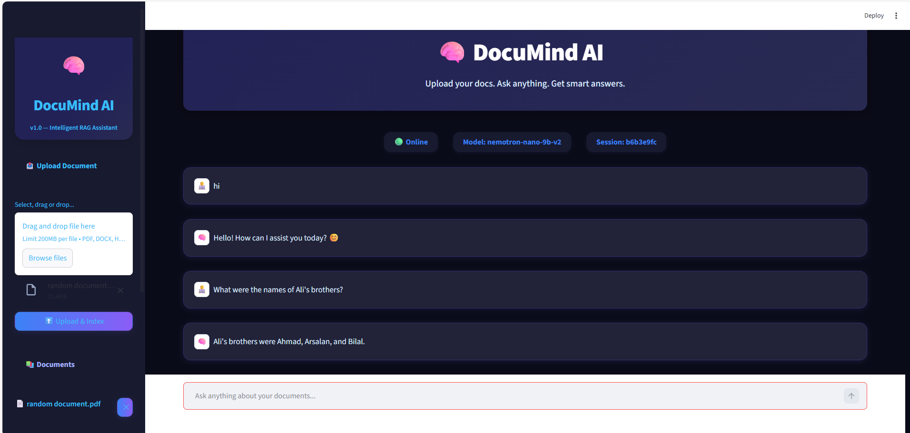

# DocuMind AI



**DocuMind AI** is an advanced Retrieval-Augmented Generation (RAG) chatbot built with **FastAPI**, **Streamlit**, **LangChain**, and **Chroma**. It allows users to upload documents in PDF, TXT, or Markdown format, indexes them, and enables interactive Q&A chat with context-aware answers from your uploaded documents.

---

## 🚀 Features

- **Intelligent RAG Assistant**: Combines powerful retrieval and generative AI for smart document search and Q&A.
- **Multi-format Document Support**: Upload PDFs, DOCX, TXT, or MD files (up to 200MB per file).
- **Seamless Indexing & Search**: Instantly index your documents for fast, context-driven chat.
- **Modern UI**: Built with Streamlit for a clean, interactive user experience.
- **Backend API**: FastAPI powers robust document handling and indexing.
- **Chat with Documents**: Use natural language to ask questions and retrieve answers from your files.

---

## 📂 Project Structure

- [`backend/`](https://github.com/AbdulRehman393/DocuMind-AI/tree/main/backend)  
  Contains FastAPI backend source code responsible for handling uploads, document parsing, vectorization, and serving the API endpoints.

- [`frontend/`](https://github.com/AbdulRehman393/DocuMind-AI/tree/main/frontend)  
  Streamlit-powered frontend for user interactions. Handles file uploads, chat interface, and displays answers.

- [`.env.example`](https://github.com/AbdulRehman393/DocuMind-AI/blob/main/.env.example)  
  Example environment configuration file. Copy and rename to `.env` for local setup.

- [`requirements.txt`](https://github.com/AbdulRehman393/DocuMind-AI/blob/main/requirements.txt)  
  Python dependencies for both backend and frontend.

---

## 🖼️ Demo


The screenshot above shows the sleek UI, document upload section, chat interface, and smart answer retrieval.

---

## ⚡ Quick Start

### 1. Clone the Repo

```bash
git clone https://github.com/AbdulRehman393/DocuMind-AI.git
cd DocuMind-AI
```

### 2. Setup Python Environment

```bash
python -m venv venv
source venv/bin/activate  # On Windows: venv\Scripts\activate
pip install -r requirements.txt
```

### 3. Configure Environment Variables

Copy `.env.example` to `.env` and modify as required (API keys, ports, etc.)

### 4. Run Backend

```bash
cd backend
uvicorn main:app --reload
```

### 5. Launch Frontend

Open a new terminal:

```bash
cd frontend
streamlit run app.py
```

### 6. Access the App

Visit `http://localhost:8501` (or the address shown in terminal).

---

## ⚙️ Folder & File Overview

- **backend/**  
  - Main FastAPI app and APIs for document upload, processing, retrieval.
  - LangChain integration.
  - Chroma vector database handling.

- **frontend/**  
  - Streamlit UI.
  - Chat window.
  - File upload and index.

- **requirements.txt**  
  - Lists Python libraries for both frontend and backend.

- **.env.example**  
  - Skeleton for required environment variables.

---

## 🧠 How It Works

1. **Upload Document**: Drag and drop files (PDF/TXT/MD).
2. **Index & Process**: Backend vectorizes and stores data using Chroma & LangChain.
3. **Chat**: Type questions; DocuMind AI fetches relevant context and generates answers.

---

## 📦 Tech Stack

- **FastAPI** – Backend API
- **Streamlit** – Frontend UI
- **LangChain** – LLM-powered document retrieval
- **Chroma** – Vector database
- **Python** – 100%

---

## 👤 Author

- [AbdulRehman393](https://github.com/AbdulRehman393)

---

## ⭐️ Contributing

Pull requests are welcome! For major changes, please open an issue first to discuss.

---

## 📄 License

Distributed under the MIT License. See [LICENSE](LICENSE) for details.

---

## 🔗 Links

- [Live Demo (if available)](https://github.com/AbdulRehman393/DocuMind-AI)
- [Issues](https://github.com/AbdulRehman393/DocuMind-AI/issues)

---

Build your own AI-powered document assistant today!
